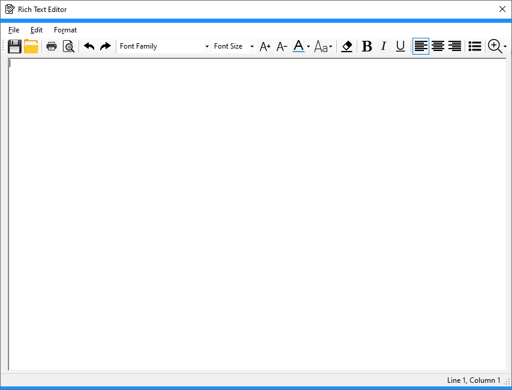
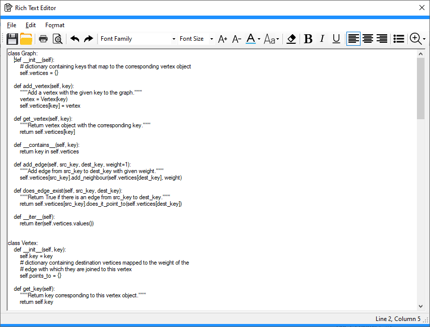
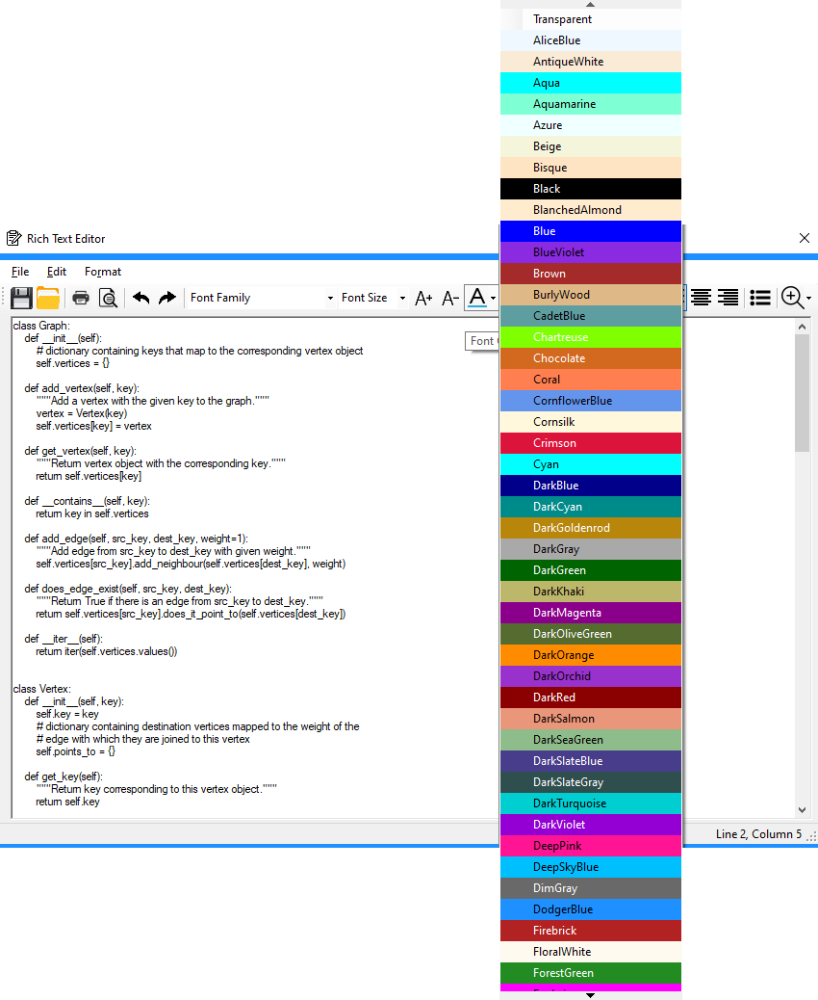
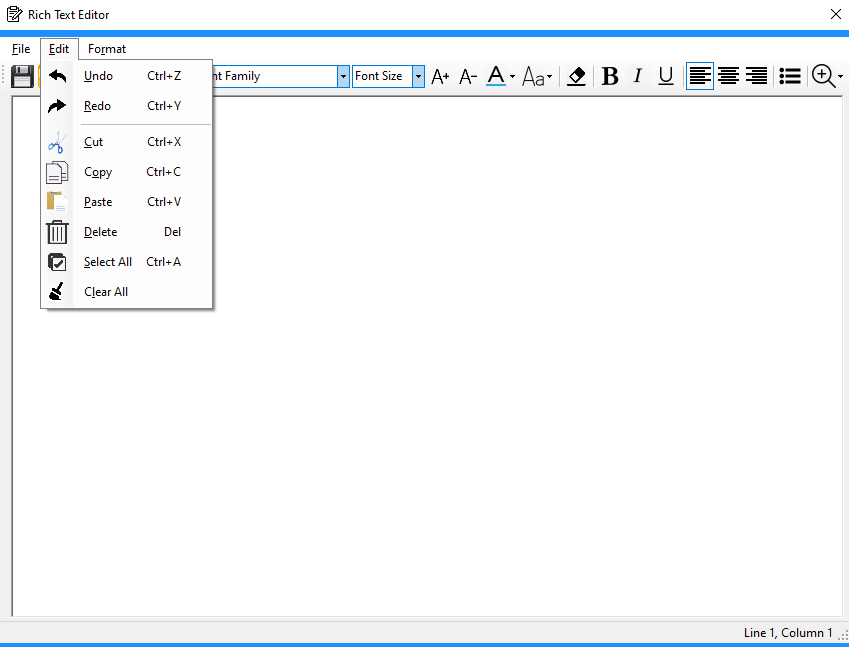

# Text Editor - Windows Forms

This application is a text editor written in C# and Windows Forms as part of my college class final project in Fall 2016. Other projects
for the final project included:

* Simple login program using a SQL local database with Visual Studio. 
***Link to source***: https://github.com/hjohnson12/LoginPanel
* Simple implementation of a file watcher program that watches a source directory for changes and copies the changes to the destination directory. 
***Link to source***:  https://github.com/hjohnson12/FileSync
* Basic application that connects to a ftp server and does simple operations such as read contents in a directory, upload a file, and delete a file.
***Link to source***: https://github.com/hjohnson12/FtpConnect  

***NOTE: This version is not currently being worked on, waiting on XAML Islands release for further update***
 * This project was re-made into a Windows 10 Universal Windows Platform application a couple years ago when testing with UWP for the first time. It is now being re-made to use the newer framework and controls when free time is available: https://github.com/hjohnson12/NotepadEditorUWP 

### Screenshots of WinForms Version

##### Standard design for text editor:



##### Able to open files and display them into the editor:

* Line/Column numbers also show according to where your cursor is selected



##### Able to see an example of the color before you choose it:




* Uses a KnownColor object for the selected color. Once backcolor is set, it converts the color to RGB values and
determines if its considered a lighter or darker color. It then changes the text color accordingly:
  * The following is the C# snippet:
  ```csharp
  // fill colors in color drop down list
            foreach (System.Reflection.PropertyInfo prop in typeof(Color).GetProperties())
            {
                if (prop.PropertyType.FullName == "System.Drawing.Color")
                {
                    colorList.Add(prop.Name);     
                }
            }
           
            // fill the drop down items list
            foreach(string color in colorList)
            {
                colorStripDropDownButton.DropDownItems.Add(color);
            }

            // fill BackColor for each color in the DropDownItems list
            for (int i = 0; i < colorStripDropDownButton.DropDownItems.Count; i++)
            {
                // Create KnownColor object
                KnownColor selectedColor;
                selectedColor = (KnownColor)System.Enum.Parse(typeof(KnownColor), colorList[i]);    // parse to a KnownColor
                colorStripDropDownButton.DropDownItems[i].BackColor = Color.FromKnownColor(selectedColor);    // set the BackColor to its appropriate list item

                // Set the text color depending on if the barkground is darker or lighter
                // create Color object
                Color col = Color.FromName(colorList[i]);

                // 255,255,255 = White and 0,0,0 = Black
                // Max sum of RGB values is 765 -> (255 + 255 + 255)
                // Middle sum of RGB values is 382 -> (765/2)
                // Color is considered darker if its <= 382
                // Color is considered lighter if its > 382
                sumRGB = ConvertToRGB(col);    // get the color objects sum of the RGB value
                if (sumRGB <= MIDDLE)    // Darker Background
                {
                    colorStripDropDownButton.DropDownItems[i].ForeColor = Color.White;    // set to White text
                }
                else if (sumRGB > MIDDLE)    // Lighter Background
                {
                    colorStripDropDownButton.DropDownItems[i].ForeColor = Color.Black;    // set to Black text
                }
            }
  ```


##### Icons on each menu item in the menu bar:



### Prerequisites

Requires *Visual Studio 2017 or higher* to run. 

## Built With

* C# Windows Forms

## Contributing

[Coming Soon]

## Authors

* **Hunter** - *Initial work* - [hjohnson012](https://github.com/hjohnson012)

See also the list of [contributors](https://github.com/hjohnson12/KanbanBoardUWP/graphs/contributors) who participated in this project.

## License

This project is licensed under the MIT License - see the [LICENSE.md](LICENSE.md) file for details
